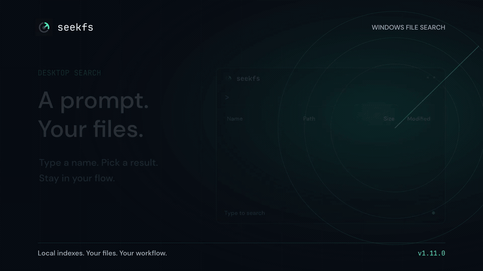
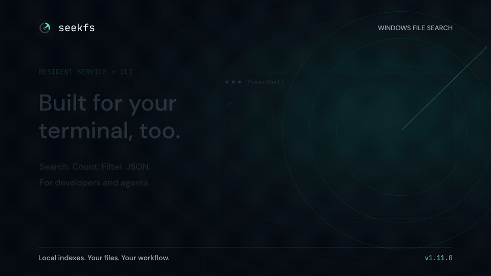

<p align="center">
  
</p>
<h1 align="center">seekfs</h1>
<p align="center"><strong>Find your files. Keep your flow.</strong><br />Local file search for Windows, with a desktop prompt and a powerful CLI.</p>
<p align="center">
  <a href="https://github.com/holdfast-labs/seekfs/releases/latest"></a>
  <a href="https://github.com/holdfast-labs/seekfs/actions/workflows/windows.yml"></a>
  <a href="LICENSE"></a>
</p>
<p align="center">
  <a href="https://github.com/holdfast-labs/seekfs/releases/latest"><strong>Download for Windows</strong></a> ·
  <a href="search-syntax.md">Search syntax</a> ·
  <a href="docs/SERVICE.md">Service setup</a>
</p>

Find a filename, narrow a path, combine filters, or get a count. seekfs builds
compact local indexes and keeps them resident in a Windows service, so repeated
searches don't reload the database. Use the minimal desktop UI when browsing;
use the CLI and JSON output in scripts and agent workflows.

| Desktop | Terminal | Resident engine |
| --- | --- | --- |
| A focused search prompt, sortable results and file actions | Search, count, scope queries and emit JSON | Windows/NTFS indexing, local named-pipe access and journal updates |

## See it in action

**A prompt. Your files.** Search `main`, then narrow it with `ext:go dir:cmd main`.

[](media/seekfs-desktop.mp4)

**Built for your terminal, too.** Filters, structured JSON and counts.

[](media/seekfs-cli.mp4)

[Watch the 30-second launch video with sound](media/seekfs-launch.mp4).
These are fframes-rendered illustrated walkthroughs using verified fixture
results, not screen recordings or speed benchmarks. [Video sources and exports](media/README.md).

## Get started

1. Download and extract [the latest Windows zip](https://github.com/holdfast-labs/seekfs/releases/latest).
   It includes `seekfs.exe` and `seekfs-ui.exe`.
2. In an **administrator PowerShell** in the extracted folder, create a resident
   index for your NTFS volume:

   ```powershell
   .\seekfs.exe index-volumes -volume C: -launch
   ```

3. Open `seekfs-ui.exe`, or query from the terminal:

   ```powershell
   .\seekfs.exe search main
   .\seekfs.exe search -path "ext:go dir:cmd main"
   .\seekfs.exe count "ext:md"
   ```

The binaries are unsigned. The desktop executable requests administrator access
for indexing and service management. See [service setup](docs/SERVICE.md) for
additional volumes, startup behavior and permissions.

For a small CLI-only trial without a full-volume index:

```powershell
.\seekfs.exe index -root "$env:USERPROFILE\Documents" -db .\docs.gsi
.\seekfs.exe search -db .\docs.gsi report
.\seekfs.exe count -db .\docs.gsi report
```

## Search your way

| Find… | Command |
| --- | --- |
| A filename | `seekfs search main` |
| A filename under a folder | `seekfs search --under C:\git\project main.go` |
| A path with multiple terms | `seekfs search -path "src cmd"` |
| Go entry points in a command directory | `seekfs search -path "ext:go dir:cmd main"` |
| Reports excluding drafts | `seekfs search "report !draft"` |
| Images | `seekfs search "ext:png\|jpg"` |
| Large files | `seekfs search "type:file size:>100mb"` |
| Recently modified logs | `seekfs count "ext:log dm:today"` |
| Machine-readable results | `seekfs search --json main` |

Put flags before the query and quote multi-term queries. Filename search is a
good default; use `-path` when directory context matters. `--under` keeps
repository searches focused. Full syntax, sorting and filters are documented
in [search-syntax.md](search-syntax.md).

**seekfs searches names and paths, not file contents.** Use `rg` for text,
symbols and exact line matches. Both tools fit naturally into the same workflow.

When no `-db` is supplied, `search` and `count` query the resident service.
Use `-local` to read a database directly. Search also works without the
subcommand: `seekfs --under C:\git\project main.go`.

## For scripts and agents

```powershell
seekfs search --json --under C:\git\project main.go
seekfs count -path "ext:go dir:cmd main"
seekfs search -path --exists --recent 24h "ext:go"
```

Set defaults once:

```powershell
seekfs config set output_format json
seekfs config set default_limit 20
seekfs defaults --json
```

Scope file discovery with `--under`; use a filename term as well as directory
terms when possible. If seekfs isn't on PATH, call the extracted binary directly.
See [configuration](docs/CONFIG.md) and the [open service protocol](docs/OPEN_PROTOCOL.md).

## Performance, with context

The v1.11.0 memo/deferred-ranking microbenchmark measured **4.85 ms versus
11.96 ms** for a warmed broad path query over a synthetic 50,000-file fixture,
with a result limit of 20. Allocated bytes per query fell from 41.1 MB to 0.82 MB.
This is a sample result, not a promise of a 10× end-to-end speedup.
[Method, tradeoffs and reproduction command](docs/SEARCH_MEMO_REVIEW.md).

The earlier development-machine snapshot used about 23.7 million entries across
C: and F:, with roughly 3.1 GB steady service working set. Representative warm
CLI timings were 50–100 ms for `-path "src main.go"`, about 500 ms for the broad
`-path "src"` scan, and 90–100 ms for `count ext:md`. Results depend on query,
index, cache state and hardware. [Benchmark documentation](docs/BENCHMARKS.md).

## Know before you use it

- Windows and NTFS are the primary target. Ranking is simple.
- File metadata and directory subtree sizes follow journal updates. A newly
  created directory may report zero size until folded into the base index.
- Size, date and attribute filters need metadata captured by the index.
  Older indexes without it report a clear error.
- Index files contain local path names; treat them as local metadata.
- seekfs is independent software, unaffiliated with voidtools or Everything.

## Documentation and development

[Service setup](docs/SERVICE.md) · [Search syntax](search-syntax.md) ·
[Configuration](docs/CONFIG.md) · [Protocol](docs/OPEN_PROTOCOL.md) ·
[Benchmarks](docs/BENCHMARKS.md) · [Security](SECURITY.md) ·
[v1.11.0 release notes](docs/RELEASE_NOTES_1.11.0.md)

```powershell
go build -o seekfs.exe ./cmd/seekfs
go test ./...
go vet ./...
.\scripts\ci.ps1
```

Video source and render instructions live in [media/fframes](media/fframes).
The application is [MIT licensed](LICENSE).
